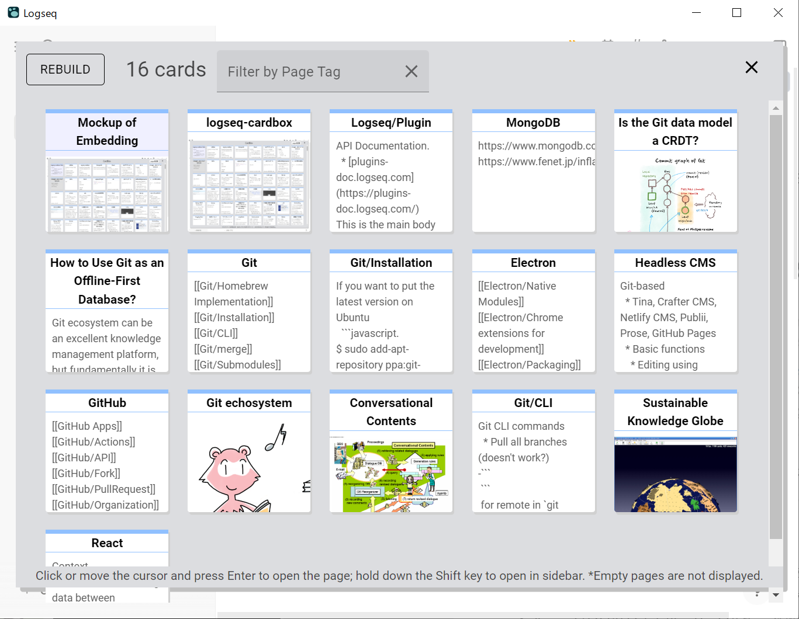
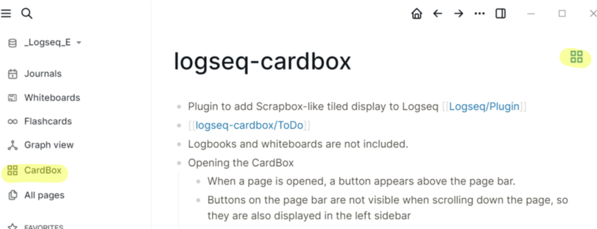
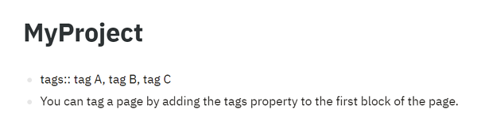

# Logseq Graph Sieve Plugin 

A card-based navigator for [Logseq](https://github.com/logseq/logseq) that shows your pages as thumbnail cards, sorted by last update. Click a card to open a rich, multi-tab preview with copy/export tools, related/sub pages, and quick favorites/archives.

## Launch
Use any of the following:
- Toolbar button labeled “CardBox”
- Command palette: “Open CardBox”
- Shortcut: Ctrl+Shift+Enter (Windows) / Cmd+Shift+Enter (macOS)

- Right after installation, the plugin builds its local database. While building, “Building...” appears in the top-left of the window. Don’t exit Logseq until it finishes.

## Cards and navigation
- Cards are ordered by last updated time (top-left is newest). Only Logseq pages are shown; journals and whiteboards are not displayed. Empty pages are hidden.
- Click a card to open it in the plugin’s preview sidebar. Shift+Click opens it directly in Logseq.
- Keyboard:
  - Arrow keys: Move selection
  - Enter: Open selected card in the plugin preview
  - Shift+Enter: Open selected card in Logseq
  - Esc: Close the plugin window

## Filtering
- Two quick filters in the top bar:
  - Filter by Page Tag: type to narrow by “page tags”
  - Filter by Page Name: partial match on page titles
- Typing when no input is focused will jump to the tag filter automatically.

What is a page tag? See below:

## Preview sidebar
Open a card to see a multi-tab preview with tools:

- Tabs
  - Content: render page blocks (toggle “Hide properties” and “Hide refs/embeds”)
  - No Markdown: plain text with formatting removed
  - RAW: outline of first lines for a compact overview
- Controls
  - Copy content: copies the current tab’s text view to the clipboard
  - Open in Logseq: jumps to the page in Logseq
  - Close / Close all tabs
- Options
  - Always hide properties: a comma-separated list of property keys to always hide (e.g., author, source). “id” and “collapsed” are always hidden.
- Navigation helpers
  - Breadcrumbs for hierarchical page names (click to open that part)
  - Sub pages section (direct children like Parent/Child)
  - Related section (name-token similarity, excluding links already shown in Content)
- Favorites and archive
  - Star to favorite a page (plugin-local). Favorites also appear in a list at the bottom of the left pane.
  - Archive to dim a page in views (doesn’t delete it).

## Closing
- Click the close icon in the top-right, press Esc, or click outside the window to close.

## Rebuild and timestamps
- For accurate “last updated” sorting, click Rebuild and select your graph’s pages folder (Graph/pages). When the pages folder is selected, file timestamps are used; otherwise Logseq’s page timestamps are used.
- After re-indexing in Logseq or editing files outside Logseq, press Rebuild to refresh order and content if needed.

## Languages
- English
- Japanese

Restart Logseq after changing language to apply it.

## Limitations
- Empty pages aren’t shown.
- Pages whose title ends with a slash (e.g., `MyPage/`) can’t be handled correctly.
- If Logseq cannot manage page modification time correctly, use Rebuild and select the pages folder to force reading file timestamps.
  - See https://github.com/logseq/logseq/issues/8556

## Support

If you like it, please consider supporting development.

## Credits

- This plugin is based on the CardBox plugin created by Hidekazu Kubota (sosuisen): https://github.com/sosuisen/logseq-cardbox (author profile: https://github.com/sosuisen)
- The Buy Me a Coffee button above links to Mr. Kubota’s page to support his work.
